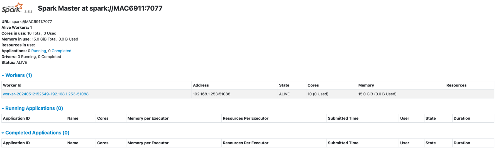

# DataStax Connection Test with Apache Spark to Apache Cassandra

## Quick Links

| What                                     | Where                                                                                     |
|------------------------------------------|-------------------------------------------------------------------------------------------|
| Medium Tutorial Integrate Spark SQL and Cassandra         | [Website](https://jentekllc8888.medium.com/tutorial-integrate-spark-sql-and-cassandra-complete-with-scala-and-python-example-codes-8307fe9c2901)                                                                                                                                                                    |
| DataStax Connector for Apache Spark to Apache Cassandra | [spark-cassandra-connector](https://github.com/datastax/spark-cassandra-connector/tree/b3.4)     |

## Requirements

* Cassandra Database 4.1.x or higher
    * Use the [Cassandra docker-compose](https://github.com/fibanez6/docker-compose/tree/main/cassandra)
* Apache Spark [3.0.x](https://spark.apache.org/downloads.html)
* Apache Hadoop [3.4.x](https://hadoop.apache.org/)
* sbt
* Java 1.8

## Features
| Dependency          | Artifact                       | Version |
|---------------------|--------------------------------|---------|
| Scala               |                                | 2.12.11 |
| com.datastax.spark  | spark-cassandra-connector_2.12 | 3.5.0   |
| org.apache.spark    | spark-core                     | 3.5.0   |
| org.apache.spark    | spark-streaming                | 3.5.0   |
| org.apache.spark    | spark-sql                      | 3.5.0   |


### **1. Navigate to Spark Directory and Start Spark**
#### **1.1 Setup Env**
```bash
export SPARK_HOME="/path/to/spark-3.5.1-bin-hadoop3"
export PYTHONPATH=$SPARK_HOME/python:$PYTHONPATH

export HADOOP_HOME=/path/to/hadoop-3.4.0
export LD_LIBRARY_PATH=$HADOOP_HOME/lib/native/:$LD_LIBRARY_PATH
```

#### **1.1 Start Master**
```bash
/path/to/spark-3.5.1-bin-hadoop3/sbin/start-master.sh
```
#### **1.2 - Get Master URL**
Navigate to localhost:8080 and copy the master URL or check in the logs:
```text
-- i.e
24/05/12 15:17:53 INFO Master: Starting Spark master at spark://MAC6911:7077
```
#### **1.3 - Start Worker**
```bash
/path/to/spark-3.5.1-bin-hadoop3/sbin/start-worker.sh <master-url>
```
#### **1.4 - Master UI**


### **2. Run assembly in sbt server**
```bash
sbt assembly
# or
sbt connection/assembly
```

### **4. Run**
```bash
$SPARK_HOME/bin/spark-submit \
  --class com.fibanez.spark.CassandraConnect \
  --master spark://MAC6911:7077 \
  /Users/Fernando.Ibanez/workplace/scala/scala-sparkSql-cassandra/connection/target/scala-2.12/connection-assembly-0.1.0-SNAPSHOT.jar
```

## Sample of use

The root package of the DataStax Connector for Apache Spark to Apache Cassandra. Offers handy implicit conversions that add Cassandra-specific methods to SparkContext and RDD.

Call cassandraTable method on the SparkContext object to create a CassandraRDD exposing Cassandra tables as Spark RDDs.

Call RDDFunctions saveToCassandra function on any RDD to save distributed collection to a Cassandra table.

Example:
```cassandraql
CREATE KEYSPACE test WITH replication = {'class': 'SimpleStrategy', 'replication_factor': 1 };
CREATE TABLE test.words (word text PRIMARY KEY, count int);
INSERT INTO test.words(word, count) VALUES ("and", 50);
```
```scala
import com.datastax.spark.connector._

val sparkMasterHost = "127.0.0.1"
val cassandraHost = "127.0.0.1"
val keyspace = "test"
val table = "words"

// Tell Spark the address of one Cassandra node:
val conf = new SparkConf(true).set("spark.cassandra.connection.host", cassandraHost)

// Connect to the Spark cluster:
val sc = new SparkContext("spark://" + sparkMasterHost + ":7077", "example", conf)

// Read the table and print its contents:
val rdd = sc.cassandraTable(keyspace, table)
rdd.toArray().foreach(println)

// Write two rows to the table:
val col = sc.parallelize(Seq(("of", 1200), ("the", "863")))
col.saveToCassandra(keyspace, table)

sc.stop()
```