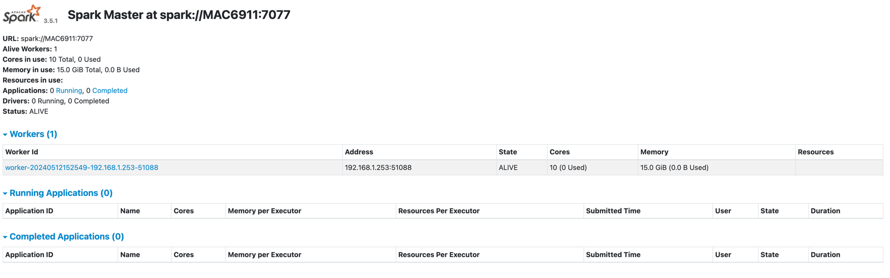

# Apache Spark Jobs for Cassandra Data Operations

## Quick Links

| What                                     | Where                                                                                     |
|------------------------------------------|-------------------------------------------------------------------------------------------|
| Anant/scala-sparkSql-cassandra  | [Github](https://github.com/Anant/scala-sparkSql-cassandra/blob/main/README.md)  |

## Requirements

* Cassandra Database 4.1.x or higher
  * Use the [Cassandra docker-compose](https://github.com/fibanez6/docker-compose/tree/main/cassandra)
* Apache Spark [3.0.x](https://spark.apache.org/downloads.html)
* sbt
* Java 1.8

## Features
| Dependency          | Artifact                       | Version |
|---------------------|--------------------------------|---------|
| Scala               |                                | 2.12.11 |
| com.datastax.spark  | spark-cassandra-connector_2.12 | 3.5.0   |
| org.apache.spark    | spark-core                     | 3.5.0   |
| org.apache.spark    | spark-streaming                | 3.5.0   |
| org.apache.spark    | spark-sql                      | 3.5.0   |

## Steps

### **1. Navigate to Spark Directory and Start Spark**
#### **1.1 Setup Env**
```bash
export SPARK_HOME="/path/to/spark-3.5.1-bin-hadoop3"
export PYTHONPATH=$SPARK_HOME/python:$PYTHONPATH
```

#### **1.1 Start Master**
```bash
$SPARK_HOME/sbin/start-master.sh
```
#### **1.2 - Get Master URL**
Navigate to localhost:8080 and copy the master URL or check in the logs:
```text
-- i.e
24/05/12 15:17:53 INFO Master: Starting Spark master at spark://MAC6911:7077
```
#### **1.3 - Start Worker**
```bash
$SPARK_HOME/sbin/start-worker.sh <master-url>
```
#### **1.4 - Master UI**


### **2. Run assembly in sbt server**
```bash
sbt assembly
# or
sbt job/clean/assembly
```

### **3. - Create `demo` keyspace**
```bash
CREATE KEYSPACE demo WITH REPLICATION={'class': 'SimpleStrategy', 'replication_factor': 1};
# or
CREATE KEYSPACE demo WITH REPLICATION={'class':'NetworkTopologyStrategy','DC1':'2'};
```

### **4. Read Spark Job**
In this job, we will look at a CSV with 100,000 records and load it into a dataframe. Once read, we will display the first 20 rows.
```bash
$SPARK_HOME/bin/spark-submit 
  --class com.fibanez.spark.Read \
  --master localhost:9042 \
  --files /path/to/scala-sparkSql-cassandra/previous_employees_by_title.csv \
  /path/to/scala-sparkSql-cassandra/job/target/scala-2.12/job-assembly-0.1.0-SNAPSHOT.jar
```

### **5. Manipulate Spark Job**
In this job, we will do the same read; however, we will now take the `first_day` and `last_day` columns and calculate the absolute value difference in days worked. Again, then display the top 20 rows.

```bash
$SPARK_HOME/bin/spark-submit --class com.fibanez.spark.Manipulate \
--master <master-url> \
--files /path/to/scala-sparkSql-cassandra/previous_employees_by_title.csv \
/path/to/scala-sparkSql-cassandra/target/scala-2.12/scala-sparkSql-cassandra-assembly-0.1.0-SNAPSHOT.jar
```

### **6. Write to Cassandra Spark Job**
In this job, we will do the same thing we did in the manipulate job; however, we will now write the outputted dataframe to Cassandra instead of just displaying it to the console.
```bash
$SPARK_HOME/bin/spark-submit --class com.fibanez.spark.Write \
--master <master-url> \
--conf spark.cassandra.connection.host=127.0.0.1 \
--conf spark.cassandra.connection.port=9042 \
--conf spark.sql.extensions=com.datastax.spark.connector.CassandraSparkExtensions \
--files /path/to/scala-sparkSql-cassandra/previous_employees_by_title.csv \
/path/to/scala-sparkSql-cassandra/target/scala-2.12/scala-sparkSql-cassandra-assembly-0.1.0-SNAPSHOT.jar
```

### **7. SparkSQL Spark Job**
In this job, we will write the CSV data into one Cassandra table and then pick it up using SparkSQL and transform it at the same time. We will then write the newly transformed data into a new Cassandra table.
```bash
$SPARK_HOME/bin/spark-submit --class com.fibanez.spark.ETL \
--master <master-url> \
--conf spark.cassandra.connection.host=127.0.0.1 \
--conf spark.cassandra.connection.port=9042 \
--conf spark.sql.extensions=com.datastax.spark.connector.CassandraSparkExtensions \
--files /path/to/scala-sparkSql-cassandra/previous_employees_by_title.csv \
/path/to/scala-sparkSql-cassandra/target/scala-2.12/scala-sparkSql-cassandra-assembly-0.1.0-SNAPSHOT.jar
```
